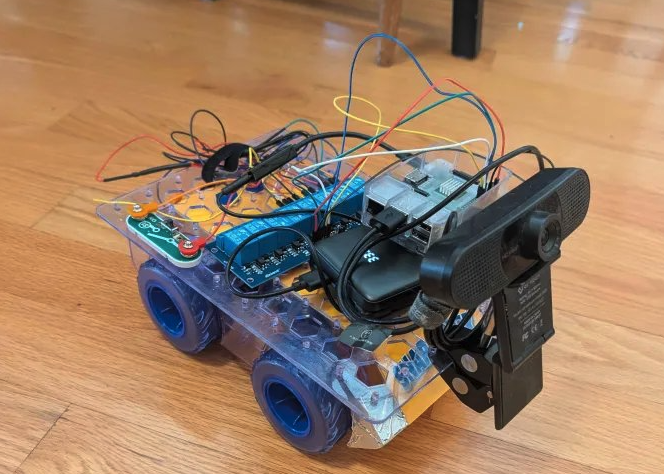

# Snap Rover Pi Web Control

Flask-based web control app for a Raspberry Pi 3B+ that drives a Snap Circuits Rover through a relay board and exposes a live USB camera stream in the browser.



## Features
- browser controls for `forward`, `reverse`, `left`, `right`, and `stop`
- MJPEG camera stream at `/stream.mjpg`
- single-frame camera snapshot at `/snapshot.jpg`
- safe startup in `stop`
- safe shutdown and GPIO cleanup on exit
- systemd service file for deployment on the Pi

## Repo layout
- `docs/` wiring and hardware notes
- `src/` application source
- `templates/` HTML template and client-side controls
- `deploy/` systemd unit file

## Hardware summary

### Pi -> relay
- pin 2 -> VCC
- pin 6 -> GND
- pin 11 -> IN1
- pin 13 -> IN2
- pin 15 -> IN3
- pin 16 -> IN4

BCM equivalents:
- pin 11 = GPIO17
- pin 13 = GPIO27
- pin 15 = GPIO22
- pin 16 = GPIO23

### Relay -> rover
For CH1 through CH4:
- COM -> rover control pin
- NO -> Orange
- NC -> Gray

Channel mapping:
- CH1 -> Green
- CH2 -> Blue
- CH3 -> Yellow
- CH4 -> White

## Motion states

These are the currently deployed command states after bring-up testing on the
real rover. The Pi-to-relay wiring still uses `IN1` through `IN4` as documented
above, but the effective rover behavior required remapping the action table to
match the final relay channel order used on the hardware.

- `forward`: IN1 LOW, IN2 HIGH, IN3 HIGH, IN4 LOW
- `reverse`: IN1 HIGH, IN2 LOW, IN3 LOW, IN4 HIGH
- `left`: IN1 LOW, IN2 HIGH, IN3 LOW, IN4 HIGH
- `right`: IN1 HIGH, IN2 LOW, IN3 HIGH, IN4 LOW
- `stop`: IN1 HIGH, IN2 HIGH, IN3 HIGH, IN4 HIGH

The relay board is assumed active-low:
- GPIO LOW energizes relay and connects COM to NO -> Orange
- GPIO HIGH de-energizes relay and connects COM to NC -> Gray

## Local development

On non-Pi machines the app falls back to a fake GPIO driver so the web UI can still run without touching hardware.

```bash
python3 -m venv .venv
source .venv/bin/activate
pip install -r requirements.txt
python -m src.main
```

Open `http://localhost:8000`.

## Pi deployment

```bash
python3 -m venv --system-site-packages .venv
source .venv/bin/activate
pip install -r requirements.txt
sudo cp deploy/rover.service /etc/systemd/system/lilbug-rover.service
sudo systemctl daemon-reload
sudo systemctl enable --now lilbug-rover.service
```

Useful commands:

```bash
sudo systemctl status lilbug-rover.service
journalctl -u lilbug-rover.service -f
```

## Environment variables
- `LILBUG_HOST`: bind host, default `0.0.0.0`
- `LILBUG_PORT`: bind port, default `8000`
- `CAMERA_INDEX`: OpenCV camera index, default `0`
- `CAMERA_WIDTH`: camera width, default `640`
- `CAMERA_HEIGHT`: camera height, default `480`
- `CAMERA_FPS`: target frame rate, default `20`
- `LOG_LEVEL`: logging level, default `INFO`

## API summary
- `GET /api/status`: current action and stream info
- `POST /api/move/<action>`: start `forward`, `reverse`, `left`, or `right`
- `POST /api/stop`: stop motion
- `GET /stream.mjpg`: live MJPEG stream
- `GET /snapshot.jpg`: single JPEG frame

## Tag Navigation

- `DRIVING_FOR_AGENTS.md` contains the room-specific findings from live driving
  experiments, including the confirmed `tag25h9` landmarks found so far and
  working pulse sizes.
- `scripts/loop_between_tags.py` runs a closed-loop AprilTag lap between the two
  known bins in the current room.
- `scripts/find_april_tag.py` is the next-step exploration tool: it uses
  AprilTag detection, a lightweight SQLite landmark KB, and optional local depth
  estimation for obstacle-aware searching.

Optional local-only depth tooling:

```bash
source .venv/bin/activate
pip install -r requirements-vision.txt
```

Example:

```bash
source .venv/bin/activate
python scripts/loop_between_tags.py --once
python scripts/find_april_tag.py --target-tag 3 --use-depth
```

Current confirmed landmarks:

- tag `0`: blue bin near fridge / doorway
- tag `1`: black bin under TV stand by fireplace
- tag `3`: low on refrigerator front
- tag `4`: low on tall cabinet by beaded-curtain doorway
- tag `5`: sofa base beneath window blinds

## Safety notes
- rover power remains separate from Pi power
- do not directly connect Orange to Gray
- the process initializes to `stop` before serving requests
- the process returns to `stop` during shutdown and on move command failures
